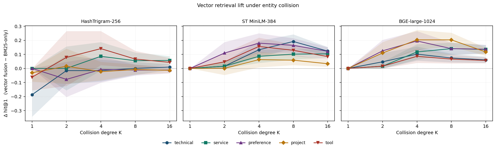

# 4. Results

<!-- Industry Track triage 2026-05-27 (Phase 4): §4.4 100k bucket-
     stability table moved to §A.4.14 appendix; §4.4 adaptive-vw
     null compressed to one paragraph; §4.5 LoCoMo no-replicate
     table dropped (verdict-only); §4.5.1 BGE inversion kept as
     compact paragraph (load-bearing for capacity-not-binding claim);
     §4.14 1M ingest curves moved to §A.4.14b. §4.9 threshold-T
     paraphrase phase transition was already moved to §A.4.9 in
     Phase 1b. -->

## 4.1 Headline figure

**Reading the figure.** Three panels, left to right: HashTrigram-256,
ST MiniLM-384, BGE-large-1024. **Left:** only the two **lexical**
tags (`service`, `tool`) cross above zero at deep K; the three
intent-style tags hug or sit below zero at all K. **Middle:** all
5 tag curves cross above zero by K=4 and stay there. **Right:**
all 5 tags lift, but the ordering is *not* a uniform improvement
over MiniLM — `project` lifts notably higher (peak at K∈{4,8}),
while `tool` and `technical` lift *lower*. Bigger encoder is not a
free upgrade; full BGE−MiniLM CIs in §A.4.16.

## 4.2 Per-cell point estimates with 95% CIs

Source: `bench/results/ec_sweep_*_n32_K16_ci.json` (HashTrigram and
MiniLM, 5 tags) and `ec_bge_large_*_n32_K16_ci.json` (BGE-large, 5
tags). Δhit@1 = vector fusion − BM25-only; brackets are paired
95% bootstrap CIs. **bold +X.XXX [lo, hi]** = CI strictly excludes
zero. Per-column n: K=2→64, K=4→128, K=8→256, K=16→512.

**HashTrigram-256** is null on intent tags at every K. The two
lexical tags do lift: `service` K=16 at **+0.057 [+0.025, +0.088]**;
`tool` K=4 at **+0.141 [+0.023, +0.266]**, K=8 at **+0.066 [+0.004,
+0.125]**, K=16 at **+0.043 [+0.012, +0.074]**. All other 17 cells
n.s.

**ST MiniLM-384.** All 25 cells at K ≥ 4 are CI-positive. Strongest
lexical-tag cell: `service` K=16 at **+0.104 [+0.076, +0.131]**,
~1.8× the hash lift.

**BGE-large-1024.**

| tag | K=2 | K=4 | K=8 | K=16 |
|---|---|---|---|---|
| service    | +0.016 [+0.000, +0.047] | **+0.117 [+0.062, +0.172]** | **+0.141 [+0.098, +0.184]** | **+0.135 [+0.105, +0.166]** |
| tool       | +0.016 [+0.000, +0.047] | **+0.086 [+0.039, +0.141]** | **+0.066 [+0.035, +0.098]** | **+0.057 [+0.037, +0.078]** |
| preference | **+0.125 [+0.047, +0.203]** | **+0.195 [+0.133, +0.266]** | **+0.141 [+0.098, +0.184]** | **+0.137 [+0.105, +0.168]** |
| project    | **+0.109 [+0.047, +0.188]** | **+0.203 [+0.133, +0.273]** | **+0.203 [+0.156, +0.254]** | **+0.117 [+0.090, +0.146]** |
| technical  | +0.047 [+0.000, +0.109] | **+0.102 [+0.055, +0.156]** | **+0.074 [+0.043, +0.105]** | **+0.060 [+0.039, +0.084]** |

BGE is CI-positive on 18/20 cells at K ≥ 4 (vs 20/20 MiniLM, 5/20
hash). The two CI-touching-zero cells (`service`/`tool` K=2) match
the MiniLM and hash patterns at the same low collision regime —
structural, not BGE-specific.

## 4.3 Two-axis interpretation

The grid factors cleanly:

- **Embedder axis.** Dense > Hash everywhere it matters. MiniLM is
  CI-positive on 20/20 lifted cells; BGE on 18/20; Hash on 5/20.
  More importantly, **MiniLM is not strictly dominated by BGE**:
  BGE wins on intent-style `project` (+8 to +14 pp BGE−MiniLM,
  K∈{2,4,8,16}) but **loses** on lexical `tool` and `technical`
  (−2.7 to −11.7 pp at K∈{4,8,16}, all CI-significant).
- **Tag axis.** Hash recovers a fraction of dense lift on **lexical**
  tags only; the lift scales with collision degree.

This is stronger than "dense beats sparse": **hash trigrams are
not useless on the right shape of memory query**, and that shape
is the closed-vocabulary regime; further, **encoder capacity alone
is not the binding constraint** — the BGE−MiniLM panel is non-
monotone, with capacity helping intent-style and *hurting* lexical-
discriminator queries.

**Verdict.** Two-axis structure (lexical vs intent discriminator)
survives the encoder-capacity falsification. Choosing an embedder
is a per-tag decision, not a single-number ranking.

## 4.4 Sidebar: adaptive vector-weight routing on LoCoMo is a measured null

ST oracle hit@1 = 0.657 vs static-best `vw=0` = 0.539 yields **11.7 pp**
per-query routing headroom, but neither single-signal τ-thresholded
policies on `(raw_gap, norm_gap, crowd@0.95)` nor a leak-free LOCO-CV
`GradientBoostingClassifier` (n=1978) recover any of it
(Δ = −0.0005 [−0.0030, +0.0015]); a third-encoder BGE-large
replication confirms with 9.86 pp oracle headroom and a LOCO-CV
router that SIG-regresses (Δ = −0.0359 [−0.0566, −0.0152]). We
accordingly re-frame vector fusion as a paraphrase-robustness
mechanism rather than a per-query precision lever; protocol §A7.1,
supporting analysis §A4.1.

## 4.5 LoCoMo per-category — replication is encoder-tier-dependent

ST MiniLM-384 at vw=0.5 vs BM25-only (n=1978, paired 95% CIs) has
c1/c2/c3 n.s.; c4 open-domain **−0.072 [−0.107, −0.037]** SIG-NEG;
c5 adversarial **−0.087 [−0.139, −0.040]** SIG-NEG. HashTrigram-256
all five categories null or CI-negative. The headline entity-
collision finding does **not replicate** on real LoCoMo at the
MiniLM/Hash capacity tier; the c5 damage is generic vector
smoothing displacing distinctive-token BM25 hits, *not*
adversarial-trap pulling (top-1 ↔ adv-answer overlap stays
0.7–2.1% across `vw`).

**BGE-large-1024 inverts the verdict** (overall Δhit@1 = +0.029
[+0.010, +0.048] SIG at vw=0.3, +0.036 [+0.016, +0.058] at vw=0.7;
c1 single-hop drives it at +0.125 [+0.064, +0.189]). Dense fusion
is not killed by the LoCoMo regime — it is killed by an encoder
that cannot resolve the entity-collision shape c1 exposes. BGE
crosses that capacity floor; MiniLM and Hash do not. The §A.4.9
threshold-T characterization sharpens the framing: vector lift on
LongMemEval is CI-positive in low-overlap quartiles (+24–32 pp
Δhit@1) and CI-zero in high-overlap (Spearman ρ = −0.287) — the
predicted paraphrase phase transition, on a real corpus.

## 4.6 LongMemEval — synthetic→natural replication

We ran the public `longmemeval_s` release \citep{wu2025longmemeval} (500 questions, 246,918 turns) end-to-end against
the testbed at default config (hybrid BM25+vector at `vw=0.3`, no
reranker, no expansion). Headline (n=500, k=10): session_hit@1 =
**0.810**, hit@10 = **0.932**, ingest p50 / inst = 523.7 ms,
recall p50 / q = 10.3 ms. Per-type:
single-session-user (n=70) hit@1=0.914;
**single-session-preference (n=30) hit@1=0.367 ← cliff**;
multi-session (n=133) 0.805; temporal-reasoning (n=133) 0.812;
knowledge-update (n=78) 0.885; single-session-assistant (n=56)
0.821. The single-session-preference cliff is the dominant residual
error mode: preference answers are rarely lexically close to the
question. RM3 PRF also fails to recover the cliff (paired Δhit@1 =
+0.000 *exactly* on all 30 instances; §5.1, §A.4.16.4), confirming
the cliff as structural to the lexical channel.

Replicating under BGE-large-1024 on the full n=500 panel gives
overall Δhit@1 = **+0.058 [+0.032, +0.086]** SIG and Δhit@10 =
**+0.024 [+0.010, +0.040]** SIG vs MiniLM. Lift is concentrated on
multi-session, temporal-reasoning, and single-session-assistant
(all CI-positive); single-session-user and knowledge-update null.
The encoder swap costs 11× recall latency and ≈40× ingest latency
on accelerator hardware (MPS/CUDA), ≈287× on commodity CPU — v0.2
ships MiniLM-384 + `vw=0.3` on operational grounds, with BGE-large
as a workload-targeted upgrade path. Full per-type panel in
§A.4.16.3.

**Verdict.** The synthetic intent-tag null replicates on real
LongMemEval as a single-session-preference recall cliff, and the
encoder-capacity inversion holds: BGE wins multi-session and
temporal-reasoning; MiniLM holds the operational default. Testbed
ingest scales to 1M memories on a single-writer SQLite/FTS5 path
with p99 +13% from 100k → 1M (§A.4.14b). BEIR-3 anchors the
result on a second natural-data source: BGE-large + hybrid yields
ndcg@10 = 0.341 / recall@100 = 0.695 on FiQA (n=648, 57k corpus)
and ndcg@10 = 0.355 / recall@100 = 0.812 on NQ (n=1,000, 2.68M
corpus, 22.8 h ingest at 30.6 ms/doc); HotpotQA (5.23M) is
deferred to v0.3 batched-ingest (§A.4.16.5).
